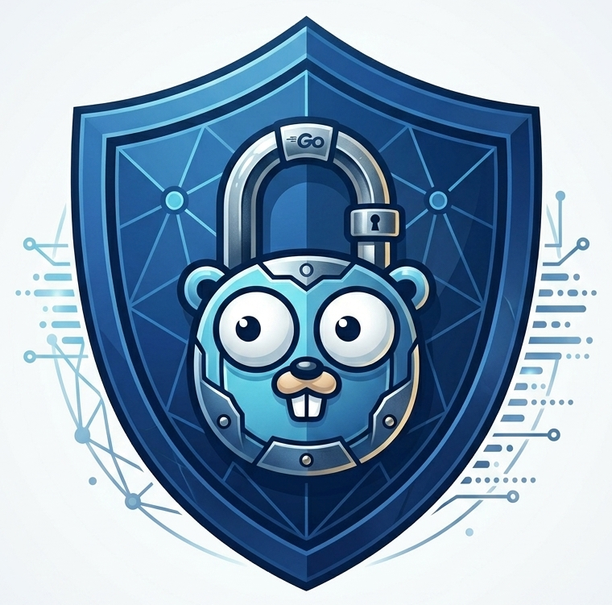

<p align="center">
  
</p>

# GoVPN

A VPN library written from scratch in Go — no OpenVPN, no WireGuard, no TLS. Peers connect over
UDP to a central hub server that routes IPv4 traffic between them, or out to the internet. Every
session is authenticated with Ed25519 signatures and encrypted with keys derived from an ephemeral
ML-KEM-768 (FIPS 203) key exchange.

govpn is a **library**, not a daemon. The tunnel data plane, the hub server, the crypto, the wire
codec and the TUN plumbing are exposed as importable packages, so you can embed an encrypted
overlay network into your own application — a CLI, a systemd service, or a web admin dashboard that
manages peers at runtime. A reference CLI lives in [`examples/sample_client`](examples/sample_client).

> **Status:** experimental. The protocol is homegrown and has not been independently audited.

---

## Contents

- [Features](#features)
- [Requirements](#requirements)
- [Installation](#installation)
- [Quick start](#quick-start)
- [Configuration](#configuration)
- [API reference](#api-reference)
  - [`server`](#server)
  - [`client`](#client)
  - [`crypto`](#crypto)
  - [`tunif`](#tunif)
  - [`proto`](#proto)
- [Building an application on top](#building-an-application-on-top)
- [How it works](#how-it-works)
- [Security properties](#security-properties)
- [Roadmap](#roadmap)
- [Limitations](#limitations)
- [License](#license)

---

## Features

- **Hybrid post-quantum cryptography.** Long-term identities are classical Ed25519 signing keys;
  session keys come from an ephemeral ML-KEM-768 encapsulation. An attacker who records traffic
  today cannot decrypt it with a quantum computer later, because the key exchange itself is
  post-quantum.
- **Forward secrecy.** Long-term keys are *only* used to sign handshake messages — never to derive
  encryption keys. Each handshake generates a fresh ML-KEM keypair, so compromising a peer's private
  key does not expose any past session.
- **Replay protection.** Every encrypted frame carries a monotonic counter nonce, checked against a
  sliding-window bitmap (8128 packets deep) that tolerates UDP reordering but rejects duplicates.
- **Mutual authentication.** The server verifies the client's signature over its ClientHello; the
  client verifies the server's signature over its ServerHello. Neither side accepts an unsigned peer.
- **Automatic rekeying.** Clients re-handshake every 5 minutes, rotating session keys and resetting
  nonce counters.
- **Hub routing.** The server forwards traffic between connected peers and exposes its own TUN
  interface for anything else, so it can act as a LAN-style mesh hub or an internet exit node.
- **Full-tunnel mode.** Optional client-side routing that sends all traffic through the VPN while
  pinning the server endpoint to the physical gateway.
- **Runtime peer management.** Peers can be added, removed, enabled and disabled while the server is
  running, with no restart and no config file reload.
- **AEAD data plane.** ChaCha20-Poly1305 over UDP, with per-direction keys.
- **Zero-dependency wire format.** A compact binary protocol you can re-implement in any language.

## Requirements

- **Go 1.26+** — the library uses the standard-library `crypto/mlkem` and `crypto/hkdf` packages.
- **Linux.** The TUN device is created with `songgao/water` and configured by shelling out to the
  `ip` command, so `iproute2` must be installed.
- **Root, or `CAP_NET_ADMIN`.** Required to create a TUN interface and modify the routing table.

## Installation

```sh
go get github.com/lbodlev888/govpn
```

## Quick start

### 1. Generate keys

Every participant — the server and each peer — needs an Ed25519 keypair.

```go
priv, _ := crypto.GeneratePrivate()   // base64 seed; keep secret
pub, _  := crypto.GetPublicKey(priv)  // base64 public key; share this
```

Or with the reference CLI:

```sh
go run ./examples/sample_client -genkey
go run ./examples/sample_client -pubkey <private-key>
```

### 2. Run a server

```go
package main

import (
	"context"
	"log"
	"os"
	"os/signal"

	"github.com/lbodlev888/govpn/config"
	"github.com/lbodlev888/govpn/server"
)

func main() {
	cfg := config.ServerConfig{
		PrivateKey:  "<server private key>",
		BindAddress: "0.0.0.0:51820",
		VirtualIP:   "10.0.0.1",
		Subnet:      24,
		Peers: []config.PeerConfig{{
			Name:      "laptop",
			PublicKey: "<laptop public key>",
			VirtualIP: "10.0.0.2",
		}},
	}

	if err := server.Init(cfg); err != nil {
		log.Fatal(err)
	}

	ctx, stop := signal.NotifyContext(context.Background(), os.Interrupt)
	defer stop()

	server.Run(ctx) // blocks until ctx is cancelled
}
```

### 3. Run a client

```go
cfg := config.PeerConfig{
	Name:       "laptop",
	PrivateKey: "<laptop private key>",
	PublicKey:  "<server public key>", // note: the SERVER's key, not your own
	VirtualIP:  "10.0.0.2",
	Subnet:     24,
	Endpoint:   "vpn.example.com:51820",
	FullTunnel: false,
}

if err := client.Init(cfg); err != nil {
	log.Fatal(err)
}
client.Run(ctx) // blocks until ctx is cancelled
```

The client handshakes immediately, then keeps the tunnel alive until the context is cancelled.

## Configuration

Both config structs carry JSON tags, so they can be loaded straight from a file.

### `config.ServerConfig`

| Field | JSON | Meaning |
|---|---|---|
| `PrivateKey` | `privkey` | The server's own base64 Ed25519 seed. |
| `BindAddress` | `bind_address` | UDP listen address, e.g. `0.0.0.0:51820`. |
| `VirtualIP` | `virtual_ip` | The server's address inside the tunnel. |
| `Subnet` | `subnet` | Prefix length for the server's TUN interface. |
| `Peers` | `peers` | The initial set of allowed peers. |

### `config.PeerConfig`

The same struct describes a peer from two different points of view, and two fields change meaning
depending on which side reads it. This is the one thing worth getting right:

| Field | JSON | On the **client** (its own config) | On the **server** (an entry in `Peers`) |
|---|---|---|---|
| `Name` | `name` | This peer's identity, sent in the ClientHello. | The key used to look the peer up. Must match. |
| `PrivateKey` | `privkey` | **This peer's own** Ed25519 seed. | Unused — leave empty. |
| `PublicKey` | `pubkey` | **The server's** public key, used to verify the ServerHello. | **This peer's** public key, used to verify its ClientHello. |
| `VirtualIP` | `virtual_ip` | The address assigned to this peer's TUN interface. | The address the server routes to this peer. |
| `Subnet` | `subnet` | Prefix length for the TUN interface. | Unused. |
| `Endpoint` | `endpoint` | The server's `host:port`. Required. | Unused. |
| `FullTunnel` | `fulltunnel` | Route all traffic through the VPN. | Unused. |
| `Disabled` | `disabled` | Unused. | Reject this peer's handshakes and drop its traffic. |

Example server config:

```json
{
  "privkey": "...",
  "bind_address": "0.0.0.0:51820",
  "virtual_ip": "10.0.0.1",
  "subnet": 24,
  "peers": [
    { "name": "laptop", "pubkey": "...", "virtual_ip": "10.0.0.2" },
    { "name": "phone",  "pubkey": "...", "virtual_ip": "10.0.0.3", "disabled": true }
  ]
}
```

Example client config:

```json
{
  "name": "laptop",
  "privkey": "...",
  "pubkey": "<server public key>",
  "virtual_ip": "10.0.0.2",
  "subnet": 24,
  "endpoint": "vpn.example.com:51820",
  "fulltunnel": true
}
```

---

## API reference

### `server`

```go
func Init(cfg config.ServerConfig) error
```
Parses the server's private key, loads the allowed peers from `cfg.Peers`, creates and configures the
TUN interface, and binds the UDP socket. Must be called before anything else in the package.

```go
func Run(ctx context.Context)
```
Starts the UDP reader and the TUN reader and **blocks** until `ctx` is cancelled, at which point it
closes the interface and the socket and returns once both loops have exited.

```go
func NewPeer(peer config.PeerConfig) error
```
Adds a peer to the allowed set at runtime. The public key is validated (base64, correct Ed25519
length) and an error is returned if it is malformed. The peer can handshake immediately — no restart
needed. Calling it with an existing `Name` replaces that entry.

```go
func GetAllPeers() []config.PeerConfig
```
Returns a snapshot of every allowed peer, in unspecified order.

```go
func RemovePeer(name string)
```
Removes the peer from the allowed set and tears down its active session, if any. Future handshakes
from it are rejected. Unknown names are ignored.

```go
func EnablePeer(name string)
func DisablePeer(name string)
```
Flip a peer's `Disabled` flag. Disabling takes effect immediately on the data plane: the peer's
in-flight traffic is dropped and new handshakes are refused, without removing its configuration.
Enabling restores it. Note that a disabled peer's session is *suspended*, not destroyed.

```go
func MarshalPeerSettings() ([]byte, error)
```
Serializes the whole server config — including the current, live peer set — as JSON. Peer mutations
are in-memory only, so call this and write the result to disk if you want them to survive a restart.

### `client`

```go
func Init(cfg config.PeerConfig) error
```
Creates the TUN interface, installs full-tunnel routes if `FullTunnel` is set, parses the keys, and
resolves the endpoint. Returns an error if `Endpoint` is empty or any key is malformed.

```go
func Run(ctx context.Context)
```
Runs the handshake loop, the keepalive loop, and the two packet-forwarding loops, **blocking** until
`ctx` is cancelled. On shutdown it removes the full-tunnel routes and closes the socket and interface.

### `crypto`

```go
func GeneratePrivate() (string, error)              // new Ed25519 seed, base64
func GetPublicKey(privKey string) (string, error)   // derive the public key from a seed
func ParsePrivateKey(privKey string) (ed25519.PrivateKey, error)
func ParsePublicKey(pubKey string) (ed25519.PublicKey, error)
```
Key generation and parsing. Keys are handled as base64 strings at the API boundary: a private key is
the 32-byte Ed25519 **seed**, a public key is the 32-byte Ed25519 public key. Both parsers reject
inputs of the wrong length.

```go
func DeriveEncryptionKey(material, salt []byte, infoString string, length int) ([]byte, error)
```
HKDF-SHA256 over the given key material. This is what turns the ML-KEM shared secret into the two
directional session keys.

```go
func SignClientHello(privKey ed25519.PrivateKey, h *proto.ClientHello) error
func SignServerHello(privKey ed25519.PrivateKey, h *proto.ServerHello) error
func CheckClientHello(pubKey ed25519.PublicKey, h proto.ClientHello) bool
func CheckServerHello(pubKey ed25519.PublicKey, h proto.ServerHello) bool
```
Handshake signing and verification. `SignClientHello` stamps the current time into the message before
signing it; `CheckClientHello` verifies both the signature *and* that the timestamp is within 2
seconds of now. The two message types are signed under distinct Ed25519 contexts (`"clientHello"` /
`"serverHello"`), so a signature from one can never be replayed as the other.

You only need these if you are implementing your own client or server. The bundled `client` and
`server` packages call them for you.

### `tunif`

```go
const MTU = "1420"

func SetupInterface(localAddr string) (*water.Interface, error)  // localAddr is CIDR, e.g. "10.0.0.2/24"
func SetupFullTunnel(endpoint, ifaceName string) error
func ClearFullTunnel(endpoint string) error
```
TUN device creation (named `bvpn0`, `bvpn1`, …) and routing. `SetupFullTunnel` installs `0.0.0.0/1`
and `128.0.0.0/1` routes over the tunnel — which override the default route without deleting it —
and pins a host route to the VPN endpoint via the physical gateway so the encrypted packets can still
get out. `ClearFullTunnel` removes that pinned route.

### `proto`

The wire codec. `EncodeClientHello`, `DecodeClientHello`, `EncodeServerHello`, `DecodeServerHello`,
`EncodeKeepAlive` and `DecodeKeepAlive` convert between structs and bytes; every decoder validates
lengths and rejects malformed input.

`proto.Filter` is the replay window:

```go
func (f *Filter) ValidateNonce(seq uint64) bool  // false if replayed or too old
func (f *Filter) Reset()                         // call on rekey
```

It is safe for concurrent use. `ValidateNonce` accepts a counter that is ahead of, or up to 8128
behind, the highest one seen, as long as it has not been seen before; anything else is rejected.

---

## Building an application on top

The intended pattern — used by the web admin dashboard this library was built for — is to run the hub
in-process and drive it through the `server` API:

```go
if err := server.Init(cfg); err != nil {
	log.Fatal(err)
}

go server.Run(ctx) // data plane runs in the background

// ... your HTTP handlers now mutate the live peer set:
//   POST   /peers        -> server.NewPeer(p)
//   GET    /peers        -> server.GetAllPeers()
//   DELETE /peers/{name} -> server.RemovePeer(name)
//   POST   /peers/{name}/disable -> server.DisablePeer(name)
//   POST   /peers/{name}/enable  -> server.EnablePeer(name)
//
// ... and persist them when you're done:
data, _ := server.MarshalPeerSettings()
os.WriteFile("/etc/govpn/config.json", data, 0600)
```

Two things to know before you build on this:

- **The `server` and `client` packages hold state in package-level globals.** One server and one
  client per process; calling `Init` twice reconfigures the singleton rather than creating a second
  instance. For a control-plane application this is usually what you want, but it means you cannot
  run two hubs in one binary.
- **All peer-management calls are safe to make from HTTP handlers.** They take the appropriate locks
  and are designed to be called concurrently with a running `Run`.

To onboard a peer, generate a keypair, hand the private key to the peer, and register the public key
with `server.NewPeer` — the peer's `Name` and `VirtualIP` are assigned by you, not chosen by the peer.

---

## How it works

### Handshake

Three messages, over UDP. The client drives it; the server holds nothing but a short-lived pending
session until the third one lands.

```
client                                                         server
  |                                                              |
  |  1. ClientHello                                              |
  |     name ‖ ephemeral ML-KEM-768 encapsulation key ‖          |
  |     timestamp ‖ Ed25519 signature over all three             |
  |------------------------------------------------------------->|
  |                          verifies signature against the       |
  |                          registered public key for `name`,    |
  |                          checks the timestamp is fresh,       |
  |                          encapsulates to the ephemeral key    |
  |                                                              |
  |  2. ServerHello                                              |
  |     ML-KEM ciphertext ‖ Ed25519 signature over it            |
  |<-------------------------------------------------------------|
  |                                                              |
  | verifies the server's signature,                             |
  | decapsulates -> shared secret,                               |
  | derives both session keys                                    |
  |                                                              |
  |  3. ClientConfirm                                            |
  |     an empty AEAD frame sealed under the c2s key             |
  |------------------------------------------------------------->|
  |                          opens it — which is only possible    |
  |                          if the client really derived the     |
  |                          same secret — and only then          |
  |                          activates the session                |
```

The shared secret produced by ML-KEM is fed into HKDF-SHA256 twice, once per direction:

```
c2sKey = HKDF-SHA256(secret, salt=nil, info="c2s_"+name, 32 bytes)   // client -> server
s2cKey = HKDF-SHA256(secret, salt=nil, info="s2c_"+name, 32 bytes)   // server -> client
```

Between messages 2 and 3 the server keeps the half-open session in a pending table, keyed by the
client's UDP address and expired after 5 seconds. Only a successful ClientConfirm promotes it into
the routing tables. This is what makes a replayed ClientHello harmless: an attacker who re-sends a
captured ClientHello does not hold the ephemeral ML-KEM decapsulation key, cannot open the
ServerHello, cannot produce a valid confirmation, and so can never displace the real peer's session.

### Data plane

Every data packet is a raw IPv4 packet sealed with ChaCha20-Poly1305 under the sender's directional key:

```
+------+---------------------+----------------------------------+
| 0x03 | nonce (12 bytes)    | ciphertext ‖ Poly1305 tag        |
+------+---------------------+----------------------------------+
```

The nonce is a per-session counter, incremented atomically for every packet and written big-endian
into the first 8 bytes. The receiver decrypts, then runs the counter through the sliding-window
filter and drops anything it has already seen.

The server routes on the decrypted IPv4 destination address:

- **Destination is another connected peer** → the frame is re-sealed under that peer's `s2c` key and
  forwarded. Peers reach each other without ever talking directly.
- **Anything else** → the frame is written to the server's TUN interface and handed to the host kernel.

Traffic to the wider internet therefore requires the usual host setup on the server: enable
`net.ipv4.ip_forward` and add a NAT rule (e.g. `iptables -t nat -A POSTROUTING -s 10.0.0.0/24 -o eth0
-j MASQUERADE`). The library configures the tunnel, not your firewall.

### Rekeying and keepalives

The client re-runs the handshake every 5 minutes, or immediately if a UDP write fails. Each rekey
generates a brand-new ML-KEM keypair, replaces both session keys, resets the replay filter, and
restarts the nonce counters from zero. A 5-byte keepalive is sent every 25 seconds to hold NAT
mappings open.

### Message types

| Byte | Message | Direction | Size |
|---|---|---|---|
| `0x01` | ClientHello | client → server | 2 + name + 1184 + 8 + 64 |
| `0x02` | ServerHello | server → client | 1 + 1088 + 64 |
| `0x03` | Data | both | 1 + 12 + payload + 16 |
| `0x04` | KeepAlive | client → server | 5 |
| `0x07` | ClientConfirm | client → server | 1 + 12 + 16 |

---

## Security properties

| Property | How |
|---|---|
| Confidentiality | ChaCha20-Poly1305 with 256-bit keys, distinct per direction and per session. |
| Post-quantum key exchange | ML-KEM-768 (FIPS 203). No classical key agreement is used anywhere, so recorded traffic cannot be decrypted by a future quantum adversary. |
| Peer authentication | Ed25519 signatures over both handshake messages, under separate domain-separation contexts. |
| Forward secrecy | Session keys derive only from a per-handshake ephemeral ML-KEM keypair. Long-term Ed25519 keys sign; they never contribute key material. Stealing one reveals nothing about past sessions. |
| Replay resistance (data) | Counter nonces plus an 8128-packet sliding-window bitmap, per direction, reset on every rekey. |
| Replay resistance (handshake) | Signed timestamps with a 2-second acceptance window, plus a confirmation message that a replaying attacker cannot forge. |
| Key compromise impersonation | A stolen long-term key allows impersonation from that point on, but does not decrypt past traffic. Rotate the key and remove the peer. |

**Clock sync matters.** Because ClientHello timestamps are only accepted within ±2 seconds, a server
or client whose clock has drifted will fail every handshake. Run NTP on both ends.

## Roadmap

The signature scheme is the last classical component in the stack. **ML-DSA (FIPS 204) is expected to
land in the Go standard library as `crypto/mldsa` in Go 1.27**; when it does, Ed25519 will be replaced
with ML-DSA and govpn becomes fully post-quantum, with no classical primitive left in the handshake.

The wire format is already set up for it: signatures are length-checked against a constant, and
switching the algorithm means changing `proto.ED25519SignatureSize`, the key parsers in `crypto`, and
nothing else in the protocol's shape.

Also planned:

- A session-inspection API (connected peers, last-handshake time, byte counters) for dashboards.
- IPv6 support in the data plane.

## Limitations

Worth knowing before you deploy this:

- **The hub sees plaintext.** Peer-to-peer traffic is decrypted and re-encrypted at the server. This
  is transport security between peer and hub, not end-to-end encryption between peers. Trust the hub.
- **IPv4 only.** Frames that are not IPv4 are dropped at both ends.
- **Linux only,** and it shells out to `ip` to configure interfaces and routes.
- **One server and one client per process** (package-level state).
- **The protocol has no version field,** so there is no in-band way to negotiate a future cipher
  change — a flag day is required.
- **Keepalives are unauthenticated** and currently only logged by the server.
- **Not audited.** This is a from-scratch implementation of a homegrown protocol, written to be
  understood, not to be a drop-in replacement for WireGuard.

## License

MIT. See [LICENSE](LICENSE).
